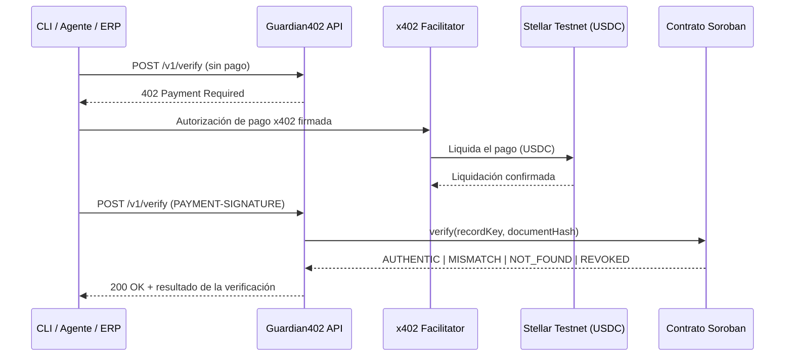

# Guardian402


> ¿El boleto en Protheus es el verdadero?

**Todos te piden que confíes en el boleto que llegó a tu bandeja de entrada. Guardian402 hace que un agente pague para averiguarlo.**

[English](README.md) · [Português](README.pt-BR.md)

**Guardian402** es una API de pago por uso que verifica si los datos de un boleto — como el posicionado en **TOTVS Protheus** o enviado por un agente — coinciden con una prueba de integridad en **Soroban**. Cada llamada se cobra en **USDC** en la **Stellar Testnet** vía **x402**. Sin cuenta, sin API key, sin suscripción.

**Sitio de presentación:** https://guardian402-summit.vercel.app
**Summit:** [Stellar Summit SP 2026](https://stellar-summit-lp.vercel.app/) — Agentic Payments (x402 / MPP)

Todo el código de este repositorio es trabajo original producido para el desafío. Referencia relacionada: [Boleto Guardian](https://guardian-labs.xyz/boleto-guardian.html).

---

## El problema

TOTVS Protheus es el ERP más utilizado en Brasil para emitir y administrar boletos — cerca del **34%** del mercado general de ERP (empatado con SAP) y cerca del **50%** en instalaciones más pequeñas, según la encuesta anual FGV-Eaesp de Uso de TI. Cualquiera de esos boletos puede alterarse después de salir del ERP: código de barras, monto, vencimiento o documento del beneficiario manipulados antes de llegar a quien lo va a pagar.

| Brecha | Cómo se ve |
| --- | --- |
| Sin verificación independiente | Se confía en el boleto porque "se ve bien" — nada lo compara criptográficamente con el registro original. |
| Integraciones cerradas | Los servicios de verificación existentes exigen registro, API keys y contratos mensuales — poco adecuado para un agente autónomo que quiere pagar por llamada. |
| Los agentes no pueden actuar solos | Un agente de IA que necesita confirmar un boleto hoy no tiene forma de pagar esa confirmación sin que un humano provisione credenciales primero. |
| Confianza todo-o-nada | Una vez que el boleto se reenvía, nada distingue uno auténtico de uno alterado hasta que el dinero ya se movió. |

Guardian402 expone un único endpoint protegido por **x402**: la propia respuesta HTTP indica cuánto cuesta la verificación, en qué red, en qué activo y a qué dirección pagar. El agente firma el pago, repite la llamada y recibe una respuesta verificada por hash — sin necesidad de cuenta.

---

## Cómo funciona



1. `POST /v1/verify` sin pago → `HTTP 402 Payment Required`.
2. El cliente firma una autorización de pago x402 en USDC.
3. El facilitator liquida el pago en Stellar Testnet.
4. La API consulta el contrato Soroban `verification-registry`.
5. La API devuelve `AUTHENTIC | MISMATCH | NOT_FOUND | REVOKED`.

Solo se almacena on-chain un hash de los datos canonicalizados del boleto — nunca el boleto en sí, CPF/CNPJ o datos bancarios. **Pagar no hace que un boleto sea auténtico**: Guardian402 verifica que los datos enviados coincidan con una prueba de integridad previamente registrada; no confirma la liquidación bancaria ni el estado del pago.

---

## Inicio rápido

```bash
git clone https://github.com/SilvaCleverson/guardian402.git
cd guardian402
npm install
cp .env.example .env
# complete X402_PAY_TO, STELLAR_PRIVATE_KEY, VERIFICATION_CONTRACT_ID
npm run build
npm run start:api
```

Requisitos previos: Node.js >= 20, el [Stellar CLI](https://developers.stellar.org/docs/tools/developer-tools) y una billetera Testnet fondeada (XLM + trustline USDC) para el cliente de demostración.

Pagar y verificar desde el CLI:

```bash
npm run guardian -- verify --boleto-id "23793381286000000000123456789012345678901234" --amount "159.90" --due-date "2026-08-10" --beneficiary-document "12345678000199"
```

En PowerShell, mantenga el comando en **una sola línea** (o use el acento grave `` ` `` para saltos de línea, no `\`).

| Comando | Descripción |
| --- | --- |
| `npm run build` | Compila los workspaces |
| `npm run start:api` | Ejecuta la API |
| `npm run dev:web` | Ejecuta el sitio de presentación localmente |
| `npm run guardian --` | Ejecuta el CLI |
| `npm run seed:demo` | Carga registros de demostración |
| `npm test` | Pruebas |

---

## Camino de pago (testnet)

| Ítem | Valor |
| --- | --- |
| Contract ID | `CARQCD7G3S7WNWA37NZS2DW4CCP2V3J4U4T4NG3FXVEW4XNALM65NHAO` |
| Explorer | [lab.stellar.org](https://lab.stellar.org/r/testnet/contract/CARQCD7G3S7WNWA37NZS2DW4CCP2V3J4U4T4NG3FXVEW4XNALM65NHAO) |
| Red | `stellar:testnet` |
| Scheme | x402 `exact` |
| Precio | `$0.01` USDC por verificación |
| Facilitator | [www.x402.org/facilitator](https://www.x402.org/facilitator) |

Variables de entorno clave:

| Variable | Descripción |
| --- | --- |
| `STELLAR_NETWORK` | ej.: `stellar:testnet` |
| `STELLAR_RPC_URL` | Endpoint Soroban RPC |
| `VERIFICATION_CONTRACT_ID` | ID del contrato desplegado |
| `X402_PRICE` | ej.: `$0.01` |
| `X402_PAY_TO` | Billetera que recibe el pago |
| `X402_FACILITATOR_URL` | Facilitator x402 |
| `STELLAR_PRIVATE_KEY` | Clave del cliente de demo — **nunca la incluya en un commit** |

---

## Referencia de la API

| Método | Ruta | Pago | Descripción |
| --- | --- | --- | --- |
| `GET` | `/health` | No | Liveness |
| `GET` | `/v1/info` | No | Metadatos del servicio |
| `POST` | `/v1/verify` | Sí (x402) | Verifica la integridad del boleto |

| Estado | Significado |
| --- | --- |
| `AUTHENTIC` | Registro activo y hash coincidente |
| `MISMATCH` | El registro existe, los datos difieren |
| `NOT_FOUND` | No hay registro para ese identificador |
| `REVOKED` | Registro revocado por el administrador |

---

## Estado

Build de hackathon para el Stellar Builder Summit SP 2026, sub-lane Agentic Payments (x402 / MPP). Qué está verificado y qué no:

| Área | Estado |
| --- | --- |
| Contrato Soroban (`contracts/verification-registry`) | `initialize` / `register` / `verify` / `revoke` + eventos. 7 pruebas unitarias exitosas. Desplegado en Testnet. |
| API (`apps/api`) | `POST /v1/verify` protegido por x402, validación con Zod, canonicalización. 3 pruebas exitosas. |
| Canonicalización compartida (`packages/shared`) | Hashing / normalización determinística. 4 pruebas exitosas. |
| Contract client (`packages/contract-client`) | Adaptador TypeScript con `simulate`, mapeo de estados, timeout. |
| Agente CLI (`apps/cli`) | Paga vía x402 y verifica los 4 estados de extremo a extremo. |
| Web (`apps/web`) | Sitio de presentación en Next.js (EN / PT / ES), desplegado en Vercel. |
| Repositorio | Público: <https://github.com/SilvaCleverson/guardian402>. No se encontraron secretos en los archivos versionados ni en el historial de git. |
| Video de demo | No grabado — opcional según las reglas del bounty, no bloquea la presentación. |

### Casos verificados de extremo a extremo

| Caso | Resultado | Evidencia |
| --- | --- | --- |
| AUTHENTIC | ok | liquidado vía pago x402 |
| MISMATCH | ok | tx `8e1965fa...` |
| NOT_FOUND | ok | tx `e5312cc6...` |
| REVOKED | ok | tx `daf44a55...` |

Facilitator usado: `https://www.x402.org/facilitator` (quickstart oficial de Stellar).

### Stack

TypeScript, Node.js >= 20, Express + Zod, Soroban (Rust), x402 `exact` / USDC Testnet, Next.js (EN/PT/ES), Vitest, npm workspaces.

---

## Problemas conocidos

- Precio fijo (`$0.01` por llamada) — aún sin precios dinámicos.
- Solo testnet — nada aquí se probó contra la mainnet de Stellar.
- El consumo nativo del endpoint desde Protheus es un ítem de roadmap, no implementado en este repositorio.

---

## No-objetivos

Cada uno de estos fue considerado y deliberadamente dejado fuera de este MVP.

| | No hace | Por qué |
| --- | --- | --- |
| NG1 | Despliegue en mainnet | El alcance del hackathon es solo Testnet. |
| NG2 | Plugin/módulo nativo en Protheus | Ítem de roadmap — este repo entrega el endpoint que el plugin invocaría. |
| NG3 | Soporte multi-ERP | El MVP apunta específicamente a Protheus, el ERP individual con mayor volumen de boletos en Brasil. |
| NG4 | KYC/AML o verificación de identidad | Fuera de alcance — Guardian402 verifica la integridad de los datos, no quién está pagando. |
| NG5 | Confirmación de liquidación bancaria | Un hash coincidente no es prueba de que el boleto haya sido pagado o liquidado. |

---

## Repositorio

| Ruta | Contenido |
| --- | --- |
| `apps/api/` | API Express protegida por x402 |
| `apps/cli/` | Cliente agente que paga y verifica |
| `apps/web/` | Sitio de presentación (Vercel) |
| `packages/shared/` | Canonicalización + hashing |
| `packages/contract-client/` | Adaptador del contrato Soroban |
| `contracts/verification-registry/` | Contrato inteligente Soroban |
| `scripts/` | Creación de billeteras, despliegue del contrato, seed de demo |
| `docs/` | Arquitectura, guion de demo, notas de seguridad, estado, presentación |

- [`docs/ARCHITECTURE.md`](docs/ARCHITECTURE.md)
- [`docs/DEMO.md`](docs/DEMO.md)
- [`docs/SECURITY.md`](docs/SECURITY.md)
- [`docs/STATUS.md`](docs/STATUS.md)
- [`docs/SUBMISSION.md`](docs/SUBMISSION.md)
- Referencia relacionada: [Boleto Guardian](https://guardian-labs.xyz/boleto-guardian.html)

<https://github.com/SilvaCleverson/guardian402> · [MIT](LICENSE)
