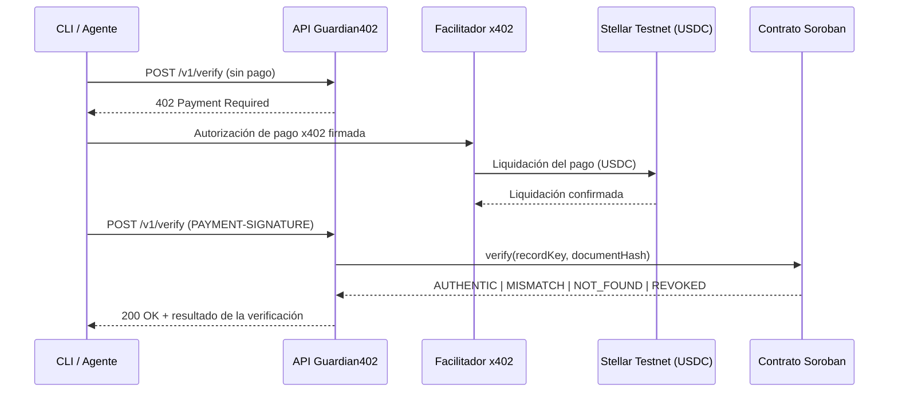

# Guardian402


> Paga por verificación. Confía en cada boleto.

[🇬🇧 English](README.md) · [🇧🇷 Português](README.pt-BR.md)

**Guardian402** es una API de pago por uso que verifica la integridad de un *boleto* (recibo de pago brasileño). Cada llamada se cobra en **USDC** en la **Stellar Testnet** mediante el protocolo **x402**, y la prueba de integridad se lee de un contrato **Soroban**. Sin cuenta, sin API key, sin suscripción — un agente paga solo por la verificación que consume.

Construido durante el **Stellar Builder Summit SP 2026** (carril Payments and Agent Tooling / Agentic Payments). Todo el código de este repositorio es trabajo original creado para el desafío.

## Índice

- [Por qué Guardian402](#por-qué-guardian402)
- [Cómo funciona](#cómo-funciona)
- [Despliegue actual (Testnet)](#despliegue-actual-testnet)
- [Stack tecnológico](#stack-tecnológico)
- [Estructura del proyecto](#estructura-del-proyecto)
- [Primeros pasos](#primeros-pasos)
- [Uso del CLI](#uso-del-cli)
- [Referencia de la API](#referencia-de-la-api)
- [Estados de verificación](#estados-de-verificación)
- [Scripts](#scripts)
- [Documentación](#documentación)
- [Seguridad y aviso legal](#seguridad-y-aviso-legal)
- [Licencia](#licencia)

## Por qué Guardian402

Las empresas y los agentes de IA que necesitan confirmar los datos de un boleto hoy dependen de integraciones cerradas, contratos comerciales, API keys y facturación mensual — un modelo poco adecuado para agentes autónomos que quieren pagar por llamada.

Guardian402 expone un único endpoint protegido por **x402**. No hay registro ni API key: la propia respuesta HTTP indica al cliente cuánto cuesta la verificación, en qué red pagar, con qué activo y a qué dirección. El agente firma el pago, repite la llamada y recibe el resultado.

## Cómo funciona



1. `POST /v1/verify` sin pago → `HTTP 402 Payment Required`.
2. El cliente firma una autorización de pago x402 en USDC.
3. El facilitador liquida el pago en la Stellar Testnet.
4. La API consulta el contrato Soroban `verification-registry`.
5. La API devuelve `AUTHENTIC | MISMATCH | NOT_FOUND | REVOKED`.

## Despliegue actual (Testnet)

| Elemento    | Valor                                                                                                 |
| ----------- | ------------------------------------------------------------------------------------------------------ |
| Contract ID | `CARQCD7G3S7WNWA37NZS2DW4CCP2V3J4U4T4NG3FXVEW4XNALM65NHAO`                                            |
| Explorer    | [lab.stellar.org](https://lab.stellar.org/r/testnet/contract/CARQCD7G3S7WNWA37NZS2DW4CCP2V3J4U4T4NG3FXVEW4XNALM65NHAO) |
| Red         | `stellar:testnet`                                                                                     |
| Precio      | `$0.01` USDC por verificación                                                                         |
| Facilitador | [www.x402.org/facilitator](https://www.x402.org/facilitator)                                          |

## Stack tecnológico

| Capa                  | Tecnología                             |
| ---------------------- | ---------------------------------------- |
| Lenguaje                | TypeScript                               |
| Runtime                 | Node.js ≥ 20                            |
| Framework de la API     | Express                                  |
| Validación              | Zod                                      |
| Contrato inteligente    | Soroban (Rust)                           |
| Blockchain              | Stellar Testnet                          |
| Protocolo de pago       | x402 — esquema `exact`                   |
| Activo                  | USDC (Testnet)                           |
| Pruebas                 | Vitest                                   |
| Monorepo                | npm workspaces                           |

## Estructura del proyecto

```text
guardian402/
├── apps/
│   ├── api/                     API Express protegida por el middleware x402
│   └── cli/                     Cliente/agente de línea de comandos que paga y verifica
├── packages/
│   ├── shared/                  Canonicalización y hashes compartidos entre API, CLI y seeds
│   └── contract-client/         Adaptador RPC hacia Soroban
├── contracts/
│   └── verification-registry/   Contrato Soroban (Rust)
├── scripts/                     Scripts auxiliares de billetera, despliegue y demo
├── docs/                        Arquitectura, demo, seguridad, estado y notas de envío
└── GUARDIAN402_CHALLENGE.md     Brief original del desafío
```

## Primeros pasos

### Requisitos previos

- Node.js ≥ 20
- [Stellar CLI](https://developers.stellar.org/docs/tools/developer-tools) (para operaciones de billetera/contrato)
- Una billetera Testnet fondeada (XLM + trustline USDC) para el cliente de demostración

### Instalación

```bash
npm install
cp .env.example .env
# completa X402_PAY_TO, STELLAR_PRIVATE_KEY, VERIFICATION_CONTRACT_ID
npm run build
npm run start:api
```

### Variables de entorno principales

| Variable                    | Descripción                                                       |
| ---------------------------- | ---------------------------------------------------------------------- |
| `STELLAR_NETWORK`            | Alias de la red, p. ej. `stellar:testnet`                              |
| `STELLAR_RPC_URL`             | Endpoint RPC de Soroban                                                |
| `VERIFICATION_CONTRACT_ID`    | Contract ID del `verification-registry` desplegado                    |
| `X402_PRICE`                  | Precio cobrado por verificación (p. ej. `$0.01`)                      |
| `X402_PAY_TO`                 | Dirección de la billetera que recibe el pago                          |
| `X402_FACILITATOR_URL`        | Endpoint del facilitador x402                                          |
| `STELLAR_PRIVATE_KEY`         | Clave de firma del cliente de demo — local, **nunca la commitees**    |

Consulta [`.env.example`](.env.example) para la lista completa.

## Uso del CLI

```bash
npm run guardian -- verify \
  --boleto-id "23793381286000000000123456789012345678901234" \
  --amount "159.90" \
  --due-date "2026-08-10" \
  --beneficiary-document "12345678000199"
```

```text
Guardian402

Target: http://localhost:3001/v1/verify
Network: stellar:testnet
Price: 0.01 USDC

[1/4] Requesting verification...
[2/4] HTTP 402 received.
[3/4] Authorizing and settling x402 payment...
[4/4] Reading verification result...

Result: AUTHENTIC
Payment transaction: 3f2c...
Contract: CARQCD7G3S7WNWA37NZS2DW4CCP2V3J4U4T4NG3FXVEW4XNALM65NHAO
```

## Referencia de la API

| Método | Ruta          | Requiere pago | Descripción                                        |
| ------ | ------------- | --------------- | ----------------------------------------------------- |
| `GET`  | `/health`      | No               | Verificación de disponibilidad                        |
| `GET`  | `/v1/info`     | No               | Metadatos del servicio (precio, red, contract ID)     |
| `POST` | `/v1/verify`   | Sí (x402)        | Verifica la integridad del boleto en el registro      |

Cuerpo de `POST /v1/verify`:

```json
{
  "boletoId": "23793381286000000000123456789012345678901234",
  "amount": "159.90",
  "dueDate": "2026-08-10",
  "beneficiaryDocument": "12345678000199"
}
```

## Estados de verificación

| Estado       | Significado                                                          |
| ------------ | ------------------------------------------------------------------------ |
| `AUTHENTIC`  | El registro existe, está activo y el hash enviado coincide.             |
| `MISMATCH`   | El registro existe, pero los datos enviados generaron un hash distinto. |
| `NOT_FOUND`  | No existe registro para el identificador indicado.                       |
| `REVOKED`    | El registro existe, pero fue revocado por el administrador del contrato.|

## Scripts

| Comando               | Descripción                              |
| ----------------------- | ------------------------------------------- |
| `npm run build`        | Compila todos los workspaces                |
| `npm run dev:api`       | Ejecuta la API en modo watch                |
| `npm run start:api`     | Ejecuta la API compilada                    |
| `npm run guardian --`   | Ejecuta el cliente CLI                      |
| `npm run seed:demo`     | Siembra registros de demostración en el contrato |
| `npm test`              | Ejecuta la suite de pruebas                 |
| `npm run lint`          | Ejecuta ESLint                              |
| `npm run format`        | Formatea con Prettier                       |

## Documentación

- [`docs/ARCHITECTURE.md`](docs/ARCHITECTURE.md) — componentes y decisiones de diseño
- [`docs/DEMO.md`](docs/DEMO.md) — guion paso a paso de la demo
- [`docs/SECURITY.md`](docs/SECURITY.md) — principios de seguridad y supuestos de confianza
- [`docs/STATUS.md`](docs/STATUS.md) — checklist de progreso por fase
- [`docs/SUBMISSION.md`](docs/SUBMISSION.md) — notas de envío del hackathon
- [`GUARDIAN402_CHALLENGE.md`](GUARDIAN402_CHALLENGE.md) — brief original del desafío

## Seguridad y aviso legal

- Solo se almacenan hashes on-chain — nunca el boleto completo, CPF/CNPJ ni datos bancarios.
- `.env` y las claves privadas nunca se commitean; usa una billetera exclusiva de Testnet para la demo.
- La liquidación del pago es independiente de la prueba de integridad: **pagar no hace que un boleto sea auténtico**.

> Guardian402 verifica si los datos de un boleto coinciden con una prueba de integridad previamente registrada. No confirma la liquidación bancaria ni el estado del pago.

Consulta [`docs/SECURITY.md`](docs/SECURITY.md) para más detalles.

## Licencia

[MIT](LICENSE)
