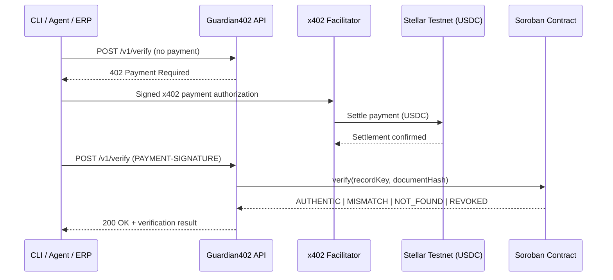

# Guardian402


> Is that boleto the real one?

**Everyone else asks you to trust the boleto sitting in your inbox. Guardian402 makes an agent pay to find out.**

[Português](README.pt-BR.md) · [Español](README.es.md)

**Guardian402** is a pay-per-use API that verifies whether boleto data — from any ERP, billing system, or agent, TOTVS Protheus (Brazil's largest ERP) among them — matches a **Soroban** integrity proof. Each call is charged in **USDC** on the **Stellar Testnet** via **x402**. No account, no API key, no subscription.

**Presentation site:** https://guardian402-summit.vercel.app/en
**Summit:** [Stellar Summit SP 2026](https://stellar-summit-lp.vercel.app/) — Agentic Payments (x402 / MPP)

All code in this repository is original work produced for the challenge. Related reference: [Boleto Guardian](https://guardian-labs.xyz/boleto-guardian.html).

---

## The problem

A boleto issued by any ERP or billing system can be altered after it leaves the system of origin: barcode, amount, due date, or beneficiary document tampered with before whoever pays it ever sees the original. Guardian402 itself is agnostic to where the boleto came from — it only cares whether the data it receives matches what was registered on-chain. TOTVS Protheus is the anchor case for this build: it's Brazil's most widely deployed ERP for issuing and managing boletos — about **34%** of the overall ERP market (tied with SAP) and about **50%** among smaller deployments, per the FGV-Eaesp Annual IT Use Survey — making it the largest single addressable market in Brazil, and the ERP the team knows best for validating the demo.

| Gap | What it looks like |
| --- | --- |
| No independent check | A boleto is trusted because it "looks right" — nothing compares it cryptographically against the original record. |
| Closed integrations | Existing verification services require signup, API keys, and monthly contracts — a poor fit for an autonomous agent that wants to pay per call. |
| Agents can't act alone | An AI agent that needs to confirm a boleto today has no way to pay for that confirmation without a human provisioning credentials first. |
| All-or-nothing trust | Once a boleto is forwarded, nothing distinguishes an authentic one from a tampered one until money has already moved. |

Guardian402 exposes a single endpoint gated by **x402**: the HTTP response itself states how much the verification costs, on which network, in which asset, and to which address. The agent signs the payment, retries the call, and gets a hash-verified answer back — no account required.

---

## How it works



1. `POST /v1/verify` without payment → `HTTP 402 Payment Required`.
2. The client signs an x402 payment authorization in USDC.
3. The facilitator settles the payment on the Stellar Testnet.
4. The API queries the Soroban `verification-registry` contract.
5. The API returns `AUTHENTIC | MISMATCH | NOT_FOUND | REVOKED`.

Only a hash of the canonicalized boleto data is stored on-chain — never the boleto itself, CPF/CNPJ, or bank data. **Paying does not make a boleto authentic**: Guardian402 verifies that the supplied data matches a previously registered integrity proof; it does not confirm bank settlement or payment status.

---

## Quickstart

```bash
git clone https://github.com/SilvaCleverson/guardian402.git
cd guardian402
npm install
cp .env.example .env
# fill in X402_PAY_TO, STELLAR_PRIVATE_KEY, VERIFICATION_CONTRACT_ID
npm run build
npm run start:api
```

Prerequisites: Node.js >= 20, the [Stellar CLI](https://developers.stellar.org/docs/tools/developer-tools), and a funded Testnet wallet (XLM + USDC trustline) for the demo client.

Pay and verify from the CLI:

```bash
npm run guardian -- verify --boleto-id "23793381286000000000123456789012345678901234" --amount "159.90" --due-date "2026-08-10" --beneficiary-document "12345678000199"
```

On PowerShell, keep the command on **one line** (or use backtick `` ` `` for line breaks, not `\`).

| Command | Description |
| --- | --- |
| `npm run build` | Build workspaces |
| `npm run start:api` | Run API |
| `npm run dev:web` | Run presentation site locally |
| `npm run guardian --` | Run CLI |
| `npm run seed:demo` | Seed demo records |
| `npm test` | Tests |

---

## Payment path (testnet)

| Item | Value |
| --- | --- |
| Contract ID | `CARQCD7G3S7WNWA37NZS2DW4CCP2V3J4U4T4NG3FXVEW4XNALM65NHAO` |
| Explorer | [lab.stellar.org](https://lab.stellar.org/r/testnet/contract/CARQCD7G3S7WNWA37NZS2DW4CCP2V3J4U4T4NG3FXVEW4XNALM65NHAO) |
| Network | `stellar:testnet` |
| Scheme | x402 `exact` |
| Price | `$0.01` USDC per verification |
| Facilitator | [www.x402.org/facilitator](https://www.x402.org/facilitator) |

Key environment variables:

| Variable | Description |
| --- | --- |
| `STELLAR_NETWORK` | e.g. `stellar:testnet` |
| `STELLAR_RPC_URL` | Soroban RPC endpoint |
| `VERIFICATION_CONTRACT_ID` | Deployed contract ID |
| `X402_PRICE` | e.g. `$0.01` |
| `X402_PAY_TO` | Wallet that receives payment |
| `X402_FACILITATOR_URL` | x402 facilitator |
| `STELLAR_PRIVATE_KEY` | Demo client key — **never commit** |
| `GUARDIAN_SEAL_BASE_URL` | Optional. When set, `/v1/verify` looks up the boleto by barcode against the [Guardian Seal](https://github.com/guardianlabsw3-lang/guardian-seal) public verification API instead of the contract above — see [ERP integration](#erp-integration-guardian-seal) |

---

## API reference

| Method | Path | Payment | Description |
| --- | --- | --- | --- |
| `GET` | `/health` | No | Liveness |
| `GET` | `/v1/info` | No | Service metadata |
| `POST` | `/v1/verify` | Yes (x402) | Verify boleto integrity |

Interactive API docs (generated from `apps/api/src/docs/openapi.ts`):

- Live static preview: [Swagger](https://guardian402-summit.vercel.app/docs) · [ReDoc](https://guardian402-summit.vercel.app/redoc) — hosted on the presentation site; "Try it out" cannot call a live backend from there.
- Fully interactive, against the real Testnet contract, while the API runs locally (`npm run start:api`, default `http://localhost:3001`): `http://localhost:3001/docs`, `http://localhost:3001/redoc`, `http://localhost:3001/openapi.json`.

| Status | Meaning |
| --- | --- |
| `AUTHENTIC` | Active record and matching hash |
| `MISMATCH` | Record exists, data diverges |
| `NOT_FOUND` | No record for that identifier |
| `REVOKED` | Record revoked by admin |

---

## ERP integration: Guardian Seal

`POST /v1/verify` can consult a real, independent boleto-sealing registry instead of Guardian402's own contract: [Guardian Seal](https://github.com/guardianlabsw3-lang/guardian-seal) (Guardian Labs), a separate platform where the issuer registers a signed, on-chain-anchored seal for a boleto at emission time.

Set `GUARDIAN_SEAL_BASE_URL` (e.g. `https://seal-api-testnet.guardian-labs.xyz`) and Guardian402 queries `GET /api/public/verify/barcode/{boletoId}` on that service instead of its own Soroban contract. Guardian Seal's `seal_status` maps to Guardian402's vocabulary:

| Guardian Seal `seal_status` | Guardian402 `status` |
| --- | --- |
| `VALID` | `AUTHENTIC` |
| `REVOKED` | `REVOKED` |
| `NOT_FOUND` (HTTP 404) | `NOT_FOUND` |
| `PENDING` / `INVALID` / `NOT_ON_CHAIN` | `MISMATCH` |

This was demonstrated live from a TOTVS Protheus (Contas a Receber) button: Protheus posts a plain JSON payload (no Stellar/x402 knowledge required) to a small local bridge acting as the paying agent, which settles the x402 payment and forwards to `/v1/verify`. Two real títulos were used — one sealed in Guardian Seal (`AUTHENTIC`), one not (`NOT_FOUND`) — see `docs/STATUS.md` for the transaction hashes.

Without `GUARDIAN_SEAL_BASE_URL`, `/v1/verify` behaves exactly as before, against Guardian402's own contract — nothing about the original flow changes.

---

## Status

Hackathon build for Stellar Builder Summit SP 2026, Agentic Payments (x402 / MPP) sub-lane. What is verified, and what is not:

| Area | State |
| --- | --- |
| Soroban contract (`contracts/verification-registry`) | `initialize` / `register` / `verify` / `revoke` + events. 7 unit tests passing. Deployed to Testnet. |
| API (`apps/api`) | x402-gated `POST /v1/verify`, Zod validation, canonicalization. 3 tests passing. |
| Shared canonicalization (`packages/shared`) | Deterministic hashing / normalization. 4 tests passing. |
| Contract client (`packages/contract-client`) | TypeScript adapter with `simulate`, status mapping, timeout handling. |
| CLI agent (`apps/cli`) | Pays via x402 and verifies all 4 statuses end to end. |
| Web (`apps/web`) | Next.js presentation site (EN / PT / ES), deployed on Vercel. |
| Repository | Public: <https://github.com/SilvaCleverson/guardian402>. No secrets found in tracked files or git history. |
| Demo video | Not recorded — optional per the bounty rules, does not block submission. |

### Verified end-to-end cases

| Case | Result | Evidence |
| --- | --- | --- |
| AUTHENTIC | ok | settled via x402 payment |
| MISMATCH | ok | tx `8e1965fa...` |
| NOT_FOUND | ok | tx `e5312cc6...` |
| REVOKED | ok | tx `daf44a55...` |

Facilitator used: `https://www.x402.org/facilitator` (official Stellar quickstart).

### Stack

TypeScript, Node.js >= 20, Express + Zod, Soroban (Rust), x402 `exact` / USDC Testnet, Next.js (EN/PT/ES), Vitest, npm workspaces.

---

## Known issues

- Fixed price (`$0.01` per call) — no dynamic pricing yet.
- Testnet only — nothing here has been exercised against Stellar mainnet.
- Native Protheus consumption of the endpoint is roadmap, not implemented in this repo.

---

## Non-goals

Each of these was considered and deliberately left out of this MVP.

| | Not doing | Because |
| --- | --- | --- |
| NG1 | Mainnet deployment | Hackathon scope is Testnet only. |
| NG2 | Native Protheus plugin/module | Roadmap item — this repo ships the endpoint the plugin would call. |
| NG3 | Packaged native connectors for every ERP | The API itself is already ERP-agnostic — any system can POST the same JSON payload. Shipping turnkey plugins per ERP (Protheus included) is future scope, not required for the core service to work. |
| NG4 | KYC/AML or identity checks | Out of scope — Guardian402 checks data integrity, not who is paying. |
| NG5 | Bank settlement confirmation | A match against the registered hash is not proof the boleto was ever paid or settled. |

---

## Repository

| Path | Contents |
| --- | --- |
| `apps/api/` | Express API protected by x402 |
| `apps/cli/` | Agent client that pays and verifies |
| `apps/web/` | Presentation site (Vercel) |
| `packages/shared/` | Canonicalization + hashing |
| `packages/contract-client/` | Soroban contract adapter |
| `contracts/verification-registry/` | Soroban smart contract |
| `scripts/` | Wallet creation, contract deploy, demo seed |
| `docs/` | Architecture, demo script, security notes, status, submission |

- [`docs/ARCHITECTURE.md`](docs/ARCHITECTURE.md)
- [`docs/DEMO.md`](docs/DEMO.md)
- [`docs/SECURITY.md`](docs/SECURITY.md)
- [`docs/STATUS.md`](docs/STATUS.md)
- [`docs/SUBMISSION.md`](docs/SUBMISSION.md)
- Related reference: [Boleto Guardian](https://guardian-labs.xyz/boleto-guardian.html)

<https://github.com/SilvaCleverson/guardian402> · [MIT](LICENSE)
