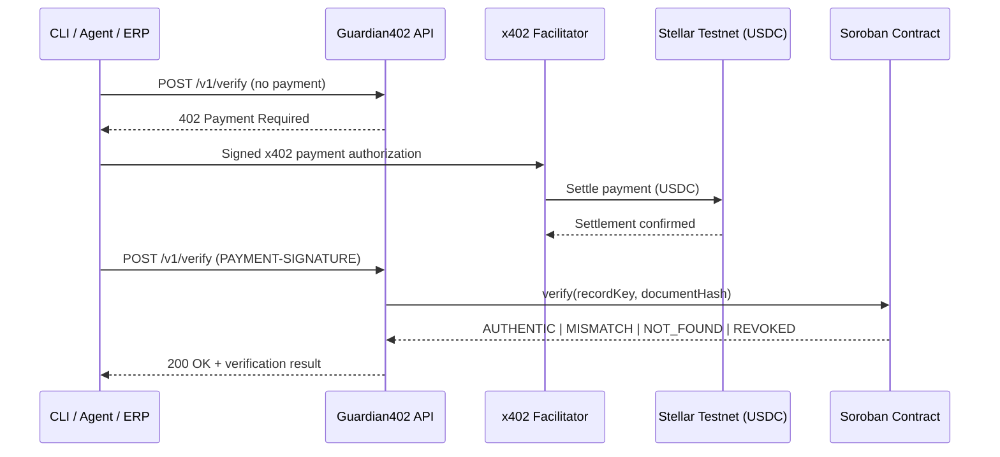

# Guardian402


> Is the boleto in Protheus the real one?

[Português](README.pt-BR.md) · [Español](README.es.md)

**Guardian402** is a pay-per-use API that verifies whether boleto data — the kind positioned in **TOTVS Protheus** or sent by an agent — matches a **Soroban** integrity proof. Each call is charged in **USDC** on the **Stellar Testnet** via **x402**. No account, no API key, no subscription.

**Presentation site:** https://guardian402-summit.vercel.app  
**Summit:** [Stellar Summit SP 2026](https://stellar-summit-lp.vercel.app/) — Payments and Agent Tooling / SDF DevEx / Agentic Payments (x402)

All code in this repository is original work produced for the challenge. Related reference: [Boleto Guardian](https://guardian-labs.xyz/boleto-guardian.html).

## What is TOTVS?

**TOTVS** is Brazil's largest business-software company. Its flagship ERP, **Protheus**, is widely used by Brazilian companies to issue and manage *boletos* (bank payment slips).

According to the latest **FGV-Eaesp** Annual IT Use Survey:

- about **34%** of Brazil's overall ERP market (tied with SAP)
- about **50%** among smaller deployments (up to ~180 users)

So verifying a Protheus boleto addresses a large share of Brazilian corporate payment flows.

## Why Guardian402

Companies and AI agents that need to confirm boleto data today depend on closed integrations, commercial contracts, API keys, and monthly billing — a poor fit for autonomous agents that want to pay per call.

Guardian402 exposes a single endpoint protected by **x402**. There is no signup and no API key: the HTTP response itself tells the caller how much the verification costs, on which network to pay, in which asset, and to which address. The agent signs the payment, retries the call, and receives the result.

**Product path**

1. Context: a boleto sitting in TOTVS Protheus needs an independent integrity check.
2. MVP (this repo): hash verification against Soroban, paid with x402 USDC.
3. Roadmap: native Protheus consumption of the same endpoint.

## How It Works



1. `POST /v1/verify` without payment -> `HTTP 402 Payment Required`.
2. The client signs an x402 payment authorization in USDC.
3. The facilitator settles the payment on the Stellar Testnet.
4. The API queries the Soroban `verification-registry` contract.
5. The API returns `AUTHENTIC | MISMATCH | NOT_FOUND | REVOKED`.

## Live Deployment (Testnet)

| Item | Value |
| --- | --- |
| Presentation | [guardian402-summit.vercel.app](https://guardian402-summit.vercel.app) |
| Contract ID | `CARQCD7G3S7WNWA37NZS2DW4CCP2V3J4U4T4NG3FXVEW4XNALM65NHAO` |
| Explorer | [lab.stellar.org](https://lab.stellar.org/r/testnet/contract/CARQCD7G3S7WNWA37NZS2DW4CCP2V3J4U4T4NG3FXVEW4XNALM65NHAO) |
| Network | `stellar:testnet` |
| Price | `$0.01` USDC per verification |
| Facilitator | [www.x402.org/facilitator](https://www.x402.org/facilitator) |

## Tech Stack

| Layer | Technology |
| --- | --- |
| Language | TypeScript |
| Runtime | Node.js >= 20 |
| API | Express + Zod |
| Smart contract | Soroban (Rust) |
| Payment | x402 `exact` / USDC Testnet |
| Web | Next.js (EN / PT / ES) |
| Testing | Vitest |
| Monorepo | npm workspaces |

## Project Structure

```text
guardian402/
??? apps/
?   ??? api/          Express API protected by x402
?   ??? cli/          Agent client that pays and verifies
?   ??? web/          Presentation site (Vercel)
??? packages/
?   ??? shared/       Canonicalization + hashing
?   ??? contract-client/
??? contracts/
?   ??? verification-registry/
??? scripts/
??? docs/
??? GUARDIAN402_CHALLENGE.md
```

## Getting Started

### Prerequisites

- Node.js >= 20
- [Stellar CLI](https://developers.stellar.org/docs/tools/developer-tools)
- Funded Testnet wallet (XLM + USDC trustline) for the demo client

### Installation

```bash
npm install
cp .env.example .env
# fill in X402_PAY_TO, STELLAR_PRIVATE_KEY, VERIFICATION_CONTRACT_ID
npm run build
npm run start:api
```

### Key environment variables

| Variable | Description |
| --- | --- |
| `STELLAR_NETWORK` | e.g. `stellar:testnet` |
| `STELLAR_RPC_URL` | Soroban RPC endpoint |
| `VERIFICATION_CONTRACT_ID` | Deployed contract ID |
| `X402_PRICE` | e.g. `$0.01` |
| `X402_PAY_TO` | Wallet that receives payment |
| `X402_FACILITATOR_URL` | x402 facilitator |
| `STELLAR_PRIVATE_KEY` | Demo client key � **never commit** |

## CLI Usage

```bash
npm run guardian -- verify --boleto-id "23793381286000000000123456789012345678901234" --amount "159.90" --due-date "2026-08-10" --beneficiary-document "12345678000199"
```

On PowerShell, keep the command on **one line** (or use backtick `` ` `` for line breaks, not `\`).

## API Reference

| Method | Path | Payment | Description |
| --- | --- | --- | --- |
| `GET` | `/health` | No | Liveness |
| `GET` | `/v1/info` | No | Service metadata |
| `POST` | `/v1/verify` | Yes (x402) | Verify boleto integrity |

## Verification Statuses

| Status | Meaning |
| --- | --- |
| `AUTHENTIC` | Active record and matching hash |
| `MISMATCH` | Record exists, data diverges |
| `NOT_FOUND` | No record for that identifier |
| `REVOKED` | Record revoked by admin |

## Scripts

| Command | Description |
| --- | --- |
| `npm run build` | Build workspaces |
| `npm run start:api` | Run API |
| `npm run dev:web` | Run presentation site locally |
| `npm run guardian --` | Run CLI |
| `npm run seed:demo` | Seed demo records |
| `npm test` | Tests |

## Documentation

- [`docs/ARCHITECTURE.md`](docs/ARCHITECTURE.md)
- [`docs/DEMO.md`](docs/DEMO.md)
- [`docs/SECURITY.md`](docs/SECURITY.md)
- [`docs/STATUS.md`](docs/STATUS.md)
- [`docs/SUBMISSION.md`](docs/SUBMISSION.md)
- [Boleto Guardian](https://guardian-labs.xyz/boleto-guardian.html) (related reference)

## Security & Disclaimer

- Only hashes are stored on-chain � never the full boleto, CPF/CNPJ, or bank data.
- `.env` and private keys are never committed.
- **Paying does not make a boleto authentic.**

> Guardian402 verifies whether supplied boleto data matches a previously registered integrity proof. It does not confirm bank settlement or payment status.

## License

[MIT](LICENSE)
