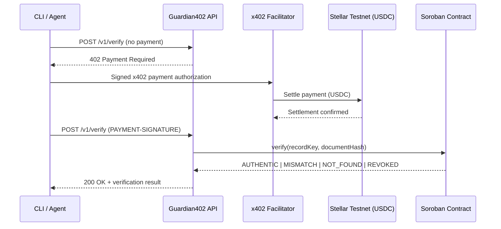

# Guardian402


> Pay per verification. Trust every boleto.

[🇧🇷 Português](README.pt-BR.md) · [🇪🇸 Español](README.es.md)

**Guardian402** is a pay-per-use API that verifies the integrity of a Brazilian *boleto* (payment slip). Each call is charged in **USDC** on the **Stellar Testnet** via the **x402** protocol, and the integrity proof is read from a **Soroban** smart contract. No account, no API key, no subscription — an agent pays only for the verification it consumes.

Built during the **Stellar Builder Summit SP 2026** (Payments and Agent Tooling / Agentic Payments lane). All code in this repository is original work produced for the challenge.

## Table of Contents

- [Why Guardian402](#why-guardian402)
- [How It Works](#how-it-works)
- [Live Deployment (Testnet)](#live-deployment-testnet)
- [Tech Stack](#tech-stack)
- [Project Structure](#project-structure)
- [Getting Started](#getting-started)
- [CLI Usage](#cli-usage)
- [API Reference](#api-reference)
- [Verification Statuses](#verification-statuses)
- [Scripts](#scripts)
- [Documentation](#documentation)
- [Security & Disclaimer](#security--disclaimer)
- [License](#license)

## Why Guardian402

Companies and AI agents that need to confirm boleto data today depend on closed integrations, commercial contracts, API keys, and monthly billing — a poor fit for autonomous agents that want to pay per call.

Guardian402 exposes a single endpoint protected by **x402**. There is no signup and no API key: the HTTP response itself tells the caller how much the verification costs, on which network to pay, in which asset, and to which address. The agent signs the payment, retries the call, and receives the result.

## How It Works



1. `POST /v1/verify` without payment → `HTTP 402 Payment Required`.
2. The client signs an x402 payment authorization in USDC.
3. The facilitator settles the payment on the Stellar Testnet.
4. The API queries the Soroban `verification-registry` contract.
5. The API returns `AUTHENTIC | MISMATCH | NOT_FOUND | REVOKED`.

## Live Deployment (Testnet)

| Item        | Value                                                                                                 |
| ----------- | ------------------------------------------------------------------------------------------------------ |
| Contract ID | `CARQCD7G3S7WNWA37NZS2DW4CCP2V3J4U4T4NG3FXVEW4XNALM65NHAO`                                            |
| Explorer    | [lab.stellar.org](https://lab.stellar.org/r/testnet/contract/CARQCD7G3S7WNWA37NZS2DW4CCP2V3J4U4T4NG3FXVEW4XNALM65NHAO) |
| Network     | `stellar:testnet`                                                                                     |
| Price       | `$0.01` USDC per verification                                                                         |
| Facilitator | [www.x402.org/facilitator](https://www.x402.org/facilitator)                                          |

## Tech Stack

| Layer            | Technology                            |
| ----------------- | -------------------------------------- |
| Language          | TypeScript                             |
| Runtime            | Node.js ≥ 20                          |
| API framework      | Express                                |
| Validation         | Zod                                    |
| Smart contract     | Soroban (Rust)                         |
| Blockchain         | Stellar Testnet                        |
| Payment protocol   | x402 — `exact` scheme                  |
| Asset              | USDC (Testnet)                         |
| Testing            | Vitest                                 |
| Monorepo           | npm workspaces                         |

## Project Structure

```text
guardian402/
├── apps/
│   ├── api/                     Express API protected by x402 middleware
│   └── cli/                     Agent/CLI client that pays and verifies
├── packages/
│   ├── shared/                  Canonicalization + hashing shared by API, CLI, and seeds
│   └── contract-client/         Soroban RPC adapter
├── contracts/
│   └── verification-registry/   Soroban contract (Rust)
├── scripts/                     Wallet, deploy, and demo helper scripts
├── docs/                        Architecture, demo, security, status, submission notes
└── GUARDIAN402_CHALLENGE.md     Original challenge brief
```

## Getting Started

### Prerequisites

- Node.js ≥ 20
- [Stellar CLI](https://developers.stellar.org/docs/tools/developer-tools) (for wallet/contract operations)
- A funded Testnet wallet (XLM + USDC trustline) for the demo client

### Installation

```bash
npm install
cp .env.example .env
# fill in X402_PAY_TO, STELLAR_PRIVATE_KEY, VERIFICATION_CONTRACT_ID
npm run build
npm run start:api
```

### Key environment variables

| Variable                    | Description                                              |
| ---------------------------- | ---------------------------------------------------------- |
| `STELLAR_NETWORK`            | Network passphrase alias, e.g. `stellar:testnet`          |
| `STELLAR_RPC_URL`             | Soroban RPC endpoint                                       |
| `VERIFICATION_CONTRACT_ID`    | Deployed `verification-registry` contract ID               |
| `X402_PRICE`                  | Price charged per verification (e.g. `$0.01`)              |
| `X402_PAY_TO`                 | Wallet address that receives the payment                   |
| `X402_FACILITATOR_URL`        | x402 facilitator endpoint                                   |
| `STELLAR_PRIVATE_KEY`         | Demo client signing key — local only, **never commit**     |

See [`.env.example`](.env.example) for the full list.

## CLI Usage

```bash
npm run guardian -- verify \
  --boleto-id "23793381286000000000123456789012345678901234" \
  --amount "159.90" \
  --due-date "2026-08-10" \
  --beneficiary-document "12345678000199"
```

```text
Guardian402

Target: http://localhost:3001/v1/verify
Network: stellar:testnet
Price: 0.01 USDC

[1/4] Requesting verification...
[2/4] HTTP 402 received.
[3/4] Authorizing and settling x402 payment...
[4/4] Reading verification result...

Result: AUTHENTIC
Payment transaction: 3f2c...
Contract: CARQCD7G3S7WNWA37NZS2DW4CCP2V3J4U4T4NG3FXVEW4XNALM65NHAO
```

## API Reference

| Method | Path          | Payment required | Description                                  |
| ------ | ------------- | ----------------- | --------------------------------------------- |
| `GET`  | `/health`      | No                 | Liveness check                                 |
| `GET`  | `/v1/info`     | No                 | Service metadata (price, network, contract ID) |
| `POST` | `/v1/verify`   | Yes (x402)         | Verify boleto integrity against the registry   |

`POST /v1/verify` body:

```json
{
  "boletoId": "23793381286000000000123456789012345678901234",
  "amount": "159.90",
  "dueDate": "2026-08-10",
  "beneficiaryDocument": "12345678000199"
}
```

## Verification Statuses

| Status      | Meaning                                                          |
| ------------ | ------------------------------------------------------------------ |
| `AUTHENTIC`  | The record exists, is active, and the submitted hash matches.     |
| `MISMATCH`   | The record exists, but the submitted data produced a different hash. |
| `NOT_FOUND`  | No record exists for the given identifier.                        |
| `REVOKED`    | The record exists but was revoked by the contract administrator.  |

## Scripts

| Command             | Description                       |
| -------------------- | ----------------------------------- |
| `npm run build`      | Build every workspace               |
| `npm run dev:api`     | Run the API in watch mode           |
| `npm run start:api`   | Run the built API                   |
| `npm run guardian --` | Run the CLI client                 |
| `npm run seed:demo`   | Seed demo records in the contract  |
| `npm test`           | Run the test suite                  |
| `npm run lint`        | Run ESLint                          |
| `npm run format`      | Format with Prettier                |

## Documentation

- [`docs/ARCHITECTURE.md`](docs/ARCHITECTURE.md) — components and design decisions
- [`docs/DEMO.md`](docs/DEMO.md) — step-by-step demo script
- [`docs/SECURITY.md`](docs/SECURITY.md) — security principles and trust assumptions
- [`docs/STATUS.md`](docs/STATUS.md) — phase-by-phase progress checklist
- [`docs/SUBMISSION.md`](docs/SUBMISSION.md) — hackathon submission notes
- [`GUARDIAN402_CHALLENGE.md`](GUARDIAN402_CHALLENGE.md) — original challenge brief

## Security & Disclaimer

- Only hashes are stored on-chain — never the full boleto, CPF/CNPJ, or bank data.
- `.env` and private keys are never committed; use a Testnet-only wallet for the demo.
- Payment settlement is independent from the integrity proof: **paying does not make a boleto authentic**.

> Guardian402 verifies whether supplied boleto data matches a previously registered integrity proof. It does not confirm bank settlement or payment status.

See [`docs/SECURITY.md`](docs/SECURITY.md) for details.

## License

[MIT](LICENSE)
