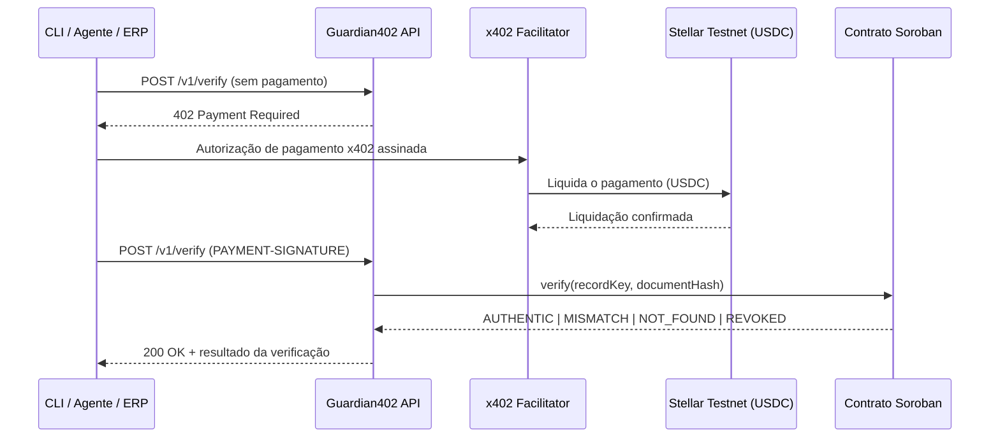

# Guardian402


> O boleto no Protheus é o boleto verdadeiro?

**Todo mundo pede pra você confiar no boleto que chegou na sua caixa de entrada. O Guardian402 faz um agente pagar para descobrir.**

[English](README.md) · [Español](README.es.md)

O **Guardian402** é uma API paga por uso que verifica se os dados de um boleto — como o posicionado no **TOTVS Protheus** ou enviado por um agente — correspondem a uma prova de integridade em **Soroban**. Cada chamada é cobrada em **USDC** na **Stellar Testnet** via **x402**. Sem conta, sem API key, sem assinatura.

**Site de apresentação:** https://guardian402-summit.vercel.app
**Summit:** [Stellar Summit SP 2026](https://stellar-summit-lp.vercel.app/) — Agentic Payments (x402 / MPP)

Todo o código deste repositório é trabalho original produzido para o desafio. Referência relacionada: [Boleto Guardian](https://guardian-labs.xyz/boleto-guardian.html).

---

## O problema

O TOTVS Protheus é o ERP mais utilizado no Brasil para emitir e gerir boletos — cerca de **34%** do mercado geral de ERP (empatado com a SAP) e cerca de **50%** nas instalações menores, segundo a pesquisa anual FGV-Eaesp de Uso de TI. Qualquer um desses boletos pode ser alterado depois que sai do ERP: código de barras, valor, vencimento ou documento do beneficiário adulterados antes de chegar a quem vai pagá-lo.

| Lacuna | Como isso aparece |
| --- | --- |
| Sem checagem independente | O boleto é confiado porque "parece certo" — nada compara os dados criptograficamente com o registro original. |
| Integrações fechadas | Serviços de verificação existentes exigem cadastro, API keys e contratos mensais — ruim para um agente autônomo que quer pagar por chamada. |
| Agentes não conseguem agir sozinhos | Um agente de IA que precisa confirmar um boleto hoje não tem como pagar por essa confirmação sem que um humano provisione credenciais antes. |
| Confiança tudo-ou-nada | Depois que o boleto é encaminhado, nada distingue um autêntico de um adulterado até o dinheiro já ter saído. |

O Guardian402 expõe um único endpoint protegido por **x402**: a própria resposta HTTP informa quanto custa a verificação, em qual rede, em qual ativo e para qual endereço pagar. O agente assina o pagamento, repete a chamada e recebe de volta uma resposta verificada por hash — sem precisar de conta.

---

## Como funciona



1. `POST /v1/verify` sem pagamento → `HTTP 402 Payment Required`.
2. O cliente assina uma autorização de pagamento x402 em USDC.
3. O facilitator liquida o pagamento na Stellar Testnet.
4. A API consulta o contrato Soroban `verification-registry`.
5. A API retorna `AUTHENTIC | MISMATCH | NOT_FOUND | REVOKED`.

Apenas um hash dos dados canonicalizados do boleto é armazenado on-chain — nunca o boleto em si, CPF/CNPJ ou dados bancários. **Pagar não torna um boleto autêntico**: o Guardian402 verifica se os dados enviados correspondem a uma prova de integridade previamente registrada; não confirma liquidação bancária nem status de pagamento.

---

## Início rápido

```bash
git clone https://github.com/SilvaCleverson/guardian402.git
cd guardian402
npm install
cp .env.example .env
# preencha X402_PAY_TO, STELLAR_PRIVATE_KEY, VERIFICATION_CONTRACT_ID
npm run build
npm run start:api
```

Pré-requisitos: Node.js >= 20, o [Stellar CLI](https://developers.stellar.org/docs/tools/developer-tools) e uma carteira Testnet fundeada (XLM + trustline USDC) para o cliente de demonstração.

Pagar e verificar pelo CLI:

```bash
npm run guardian -- verify --boleto-id "23793381286000000000123456789012345678901234" --amount "159.90" --due-date "2026-08-10" --beneficiary-document "12345678000199"
```

No PowerShell, mantenha o comando em **uma linha** (ou use crase `` ` `` para quebra de linha, não `\`).

| Comando | Descrição |
| --- | --- |
| `npm run build` | Build dos workspaces |
| `npm run start:api` | Roda a API |
| `npm run dev:web` | Roda o site de apresentação localmente |
| `npm run guardian --` | Roda o CLI |
| `npm run seed:demo` | Popula registros de demonstração |
| `npm test` | Testes |

---

## Caminho de pagamento (testnet)

| Item | Valor |
| --- | --- |
| Contract ID | `CARQCD7G3S7WNWA37NZS2DW4CCP2V3J4U4T4NG3FXVEW4XNALM65NHAO` |
| Explorer | [lab.stellar.org](https://lab.stellar.org/r/testnet/contract/CARQCD7G3S7WNWA37NZS2DW4CCP2V3J4U4T4NG3FXVEW4XNALM65NHAO) |
| Rede | `stellar:testnet` |
| Scheme | x402 `exact` |
| Preço | `$0.01` USDC por verificação |
| Facilitator | [www.x402.org/facilitator](https://www.x402.org/facilitator) |

Variáveis de ambiente principais:

| Variável | Descrição |
| --- | --- |
| `STELLAR_NETWORK` | ex.: `stellar:testnet` |
| `STELLAR_RPC_URL` | Endpoint Soroban RPC |
| `VERIFICATION_CONTRACT_ID` | ID do contrato implantado |
| `X402_PRICE` | ex.: `$0.01` |
| `X402_PAY_TO` | Carteira que recebe o pagamento |
| `X402_FACILITATOR_URL` | Facilitator x402 |
| `STELLAR_PRIVATE_KEY` | Chave do cliente de demo — **nunca commitar** |

---

## Referência da API

| Método | Rota | Pagamento | Descrição |
| --- | --- | --- | --- |
| `GET` | `/health` | Não | Liveness |
| `GET` | `/v1/info` | Não | Metadados do serviço |
| `POST` | `/v1/verify` | Sim (x402) | Verifica integridade do boleto |

| Status | Significado |
| --- | --- |
| `AUTHENTIC` | Registro ativo e hash correspondente |
| `MISMATCH` | Registro existe, dados divergem |
| `NOT_FOUND` | Nenhum registro para o identificador |
| `REVOKED` | Registro revogado pelo admin |

---

## Status

Build de hackathon para o Stellar Builder Summit SP 2026, sub-lane Agentic Payments (x402 / MPP). O que está verificado, e o que não está:

| Área | Estado |
| --- | --- |
| Contrato Soroban (`contracts/verification-registry`) | `initialize` / `register` / `verify` / `revoke` + eventos. 7 testes unitários passando. Deployado na Testnet. |
| API (`apps/api`) | `POST /v1/verify` protegido por x402, validação Zod, canonicalização. 3 testes passando. |
| Canonicalização compartilhada (`packages/shared`) | Hashing / normalização determinística. 4 testes passando. |
| Contract client (`packages/contract-client`) | Adapter TypeScript com `simulate`, mapeamento de status, timeout. |
| Agente CLI (`apps/cli`) | Paga via x402 e verifica os 4 status de ponta a ponta. |
| Web (`apps/web`) | Site de apresentação em Next.js (EN / PT / ES), deployado no Vercel. |
| Repositório | Público: <https://github.com/SilvaCleverson/guardian402>. Nenhum segredo encontrado nos arquivos versionados ou no histórico do git. |
| Vídeo da demo | Não gravado — opcional pelas regras do edital, não bloqueia a submissão. |

### Casos verificados ponta a ponta

| Caso | Resultado | Evidência |
| --- | --- | --- |
| AUTHENTIC | ok | liquidado via pagamento x402 |
| MISMATCH | ok | tx `8e1965fa...` |
| NOT_FOUND | ok | tx `e5312cc6...` |
| REVOKED | ok | tx `daf44a55...` |

Facilitator usado: `https://www.x402.org/facilitator` (quickstart oficial Stellar).

### Stack

TypeScript, Node.js >= 20, Express + Zod, Soroban (Rust), x402 `exact` / USDC Testnet, Next.js (EN/PT/ES), Vitest, npm workspaces.

---

## Problemas conhecidos

- Preço fixo (`$0.01` por chamada) — sem precificação dinâmica ainda.
- Somente testnet — nada aqui foi testado contra a mainnet da Stellar.
- Consumo nativo do endpoint pelo Protheus é item de roadmap, não implementado neste repositório.

---

## Não-objetivos

Cada um destes foi considerado e deixado de fora deliberadamente deste MVP.

| | Não faz | Por quê |
| --- | --- | --- |
| NG1 | Deploy em mainnet | Escopo do hackathon é somente Testnet. |
| NG2 | Plugin/módulo nativo no Protheus | Item de roadmap — este repo entrega o endpoint que o plugin chamaria. |
| NG3 | Suporte multi-ERP | O MVP mira especificamente o Protheus, o maior ERP isolado em volume de boletos no Brasil. |
| NG4 | KYC/AML ou checagem de identidade | Fora de escopo — o Guardian402 verifica integridade dos dados, não quem está pagando. |
| NG5 | Confirmação de liquidação bancária | Um hash correspondente não é prova de que o boleto foi pago ou liquidado. |

---

## Repositório

| Caminho | Conteúdo |
| --- | --- |
| `apps/api/` | API Express protegida por x402 |
| `apps/cli/` | Cliente agente que paga e verifica |
| `apps/web/` | Site de apresentação (Vercel) |
| `packages/shared/` | Canonicalização + hashing |
| `packages/contract-client/` | Adapter do contrato Soroban |
| `contracts/verification-registry/` | Contrato inteligente Soroban |
| `scripts/` | Criação de carteiras, deploy do contrato, seed de demo |
| `docs/` | Arquitetura, roteiro de demo, notas de segurança, status, submissão |

- [`docs/ARCHITECTURE.md`](docs/ARCHITECTURE.md)
- [`docs/DEMO.md`](docs/DEMO.md)
- [`docs/SECURITY.md`](docs/SECURITY.md)
- [`docs/STATUS.md`](docs/STATUS.md)
- [`docs/SUBMISSION.md`](docs/SUBMISSION.md)
- Referência relacionada: [Boleto Guardian](https://guardian-labs.xyz/boleto-guardian.html)

<https://github.com/SilvaCleverson/guardian402> · [MIT](LICENSE)
