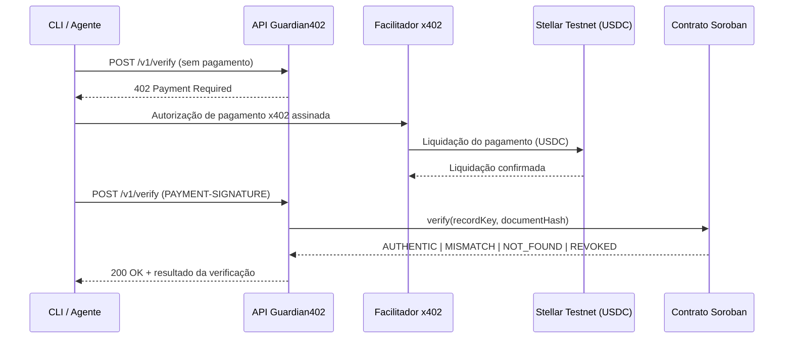

# Guardian402


> Pague por verificação. Confie em cada boleto.

[🇬🇧 English](README.md) · [🇪🇸 Español](README.es.md)

O **Guardian402** é uma API paga por uso que verifica a integridade de um boleto. Cada chamada é cobrada em **USDC** na **Stellar Testnet** via protocolo **x402**, e a prova de integridade é lida de um contrato **Soroban**. Sem conta, sem API key, sem assinatura mensal — um agente paga apenas pela verificação que consome.

Construído durante o **Stellar Builder Summit SP 2026** (lane Payments and Agent Tooling / Agentic Payments). Todo o código deste repositório é trabalho original produzido para o desafio.

## Sumário

- [Por que o Guardian402](#por-que-o-guardian402)
- [Como funciona](#como-funciona)
- [Deploy atual (Testnet)](#deploy-atual-testnet)
- [Stack tecnológica](#stack-tecnológica)
- [Estrutura do projeto](#estrutura-do-projeto)
- [Como começar](#como-começar)
- [Uso do CLI](#uso-do-cli)
- [Referência da API](#referência-da-api)
- [Status de verificação](#status-de-verificação)
- [Scripts](#scripts)
- [Documentação](#documentação)
- [Segurança e aviso legal](#segurança-e-aviso-legal)
- [Licença](#licença)

## Por que o Guardian402

Empresas e agentes de IA que precisam confirmar dados de um boleto hoje dependem de integrações fechadas, contratos comerciais, API keys e cobrança mensal — um modelo pouco adequado para agentes autônomos que querem pagar por chamada.

O Guardian402 expõe um único endpoint protegido pelo **x402**. Não há cadastro nem API key: a própria resposta HTTP informa ao cliente quanto custa a verificação, em qual rede pagar, em qual ativo e para qual endereço. O agente assina o pagamento, repete a chamada e recebe o resultado.

## Como funciona



1. `POST /v1/verify` sem pagamento → `HTTP 402 Payment Required`.
2. O cliente assina uma autorização de pagamento x402 em USDC.
3. O facilitador liquida o pagamento na Stellar Testnet.
4. A API consulta o contrato Soroban `verification-registry`.
5. A API retorna `AUTHENTIC | MISMATCH | NOT_FOUND | REVOKED`.

## Deploy atual (Testnet)

| Item        | Valor                                                                                                 |
| ----------- | ------------------------------------------------------------------------------------------------------ |
| Contract ID | `CARQCD7G3S7WNWA37NZS2DW4CCP2V3J4U4T4NG3FXVEW4XNALM65NHAO`                                            |
| Explorer    | [lab.stellar.org](https://lab.stellar.org/r/testnet/contract/CARQCD7G3S7WNWA37NZS2DW4CCP2V3J4U4T4NG3FXVEW4XNALM65NHAO) |
| Rede        | `stellar:testnet`                                                                                     |
| Preço       | `$0.01` USDC por verificação                                                                          |
| Facilitador | [www.x402.org/facilitator](https://www.x402.org/facilitator)                                          |

## Stack tecnológica

| Camada             | Tecnologia                             |
| -------------------- | ---------------------------------------- |
| Linguagem            | TypeScript                               |
| Runtime              | Node.js ≥ 20                            |
| Framework da API     | Express                                  |
| Validação            | Zod                                      |
| Contrato inteligente | Soroban (Rust)                           |
| Blockchain           | Stellar Testnet                          |
| Protocolo de pagamento | x402 — scheme `exact`                  |
| Ativo                | USDC (Testnet)                           |
| Testes               | Vitest                                   |
| Monorepo             | npm workspaces                           |

## Estrutura do projeto

```text
guardian402/
├── apps/
│   ├── api/                     API Express protegida pelo middleware x402
│   └── cli/                     Cliente/agente de linha de comando que paga e verifica
├── packages/
│   ├── shared/                  Canonicalização e hashes compartilhados entre API, CLI e seeds
│   └── contract-client/         Adaptador RPC para o Soroban
├── contracts/
│   └── verification-registry/   Contrato Soroban (Rust)
├── scripts/                     Scripts auxiliares de carteira, deploy e demo
├── docs/                        Arquitetura, demo, segurança, status e notas de submissão
└── GUARDIAN402_CHALLENGE.md     Briefing original do desafio
```

## Como começar

### Pré-requisitos

- Node.js ≥ 20
- [Stellar CLI](https://developers.stellar.org/docs/tools/developer-tools) (para operações de carteira/contrato)
- Uma carteira Testnet com saldo (XLM + trustline USDC) para o cliente de demonstração

### Instalação

```bash
npm install
cp .env.example .env
# preencha X402_PAY_TO, STELLAR_PRIVATE_KEY, VERIFICATION_CONTRACT_ID
npm run build
npm run start:api
```

### Principais variáveis de ambiente

| Variável                    | Descrição                                                    |
| ---------------------------- | ---------------------------------------------------------------- |
| `STELLAR_NETWORK`            | Alias da rede, ex.: `stellar:testnet`                            |
| `STELLAR_RPC_URL`             | Endpoint RPC do Soroban                                          |
| `VERIFICATION_CONTRACT_ID`    | Contract ID do `verification-registry` implantado                |
| `X402_PRICE`                  | Preço cobrado por verificação (ex.: `$0.01`)                      |
| `X402_PAY_TO`                 | Endereço da carteira que recebe o pagamento                      |
| `X402_FACILITATOR_URL`        | Endpoint do facilitador x402                                      |
| `STELLAR_PRIVATE_KEY`         | Chave de assinatura do cliente de demo — local, **nunca commitar** |

Veja [`.env.example`](.env.example) para a lista completa.

## Uso do CLI

```bash
npm run guardian -- verify \
  --boleto-id "23793381286000000000123456789012345678901234" \
  --amount "159.90" \
  --due-date "2026-08-10" \
  --beneficiary-document "12345678000199"
```

```text
Guardian402

Target: http://localhost:3001/v1/verify
Network: stellar:testnet
Price: 0.01 USDC

[1/4] Requesting verification...
[2/4] HTTP 402 received.
[3/4] Authorizing and settling x402 payment...
[4/4] Reading verification result...

Result: AUTHENTIC
Payment transaction: 3f2c...
Contract: CARQCD7G3S7WNWA37NZS2DW4CCP2V3J4U4T4NG3FXVEW4XNALM65NHAO
```

## Referência da API

| Método | Rota          | Exige pagamento | Descrição                                       |
| ------ | ------------- | ----------------- | -------------------------------------------------- |
| `GET`  | `/health`      | Não                | Verificação de disponibilidade                      |
| `GET`  | `/v1/info`     | Não                | Metadados do serviço (preço, rede, contract ID)    |
| `POST` | `/v1/verify`   | Sim (x402)         | Verifica a integridade do boleto no registro       |

Corpo do `POST /v1/verify`:

```json
{
  "boletoId": "23793381286000000000123456789012345678901234",
  "amount": "159.90",
  "dueDate": "2026-08-10",
  "beneficiaryDocument": "12345678000199"
}
```

## Status de verificação

| Status      | Significado                                                       |
| ------------ | --------------------------------------------------------------------- |
| `AUTHENTIC`  | O registro existe, está ativo e o hash enviado corresponde.          |
| `MISMATCH`   | O registro existe, mas os dados enviados geraram um hash diferente.  |
| `NOT_FOUND`  | Não existe registro para o identificador informado.                  |
| `REVOKED`    | O registro existe, mas foi revogado pelo administrador do contrato.  |

## Scripts

| Comando              | Descrição                            |
| --------------------- | --------------------------------------- |
| `npm run build`       | Compila todos os workspaces             |
| `npm run dev:api`      | Executa a API em modo watch             |
| `npm run start:api`    | Executa a API compilada                 |
| `npm run guardian --`  | Executa o cliente CLI                  |
| `npm run seed:demo`    | Popula registros de demonstração no contrato |
| `npm test`             | Executa a suíte de testes              |
| `npm run lint`         | Executa o ESLint                        |
| `npm run format`       | Formata com o Prettier                  |

## Documentação

- [`docs/ARCHITECTURE.md`](docs/ARCHITECTURE.md) — componentes e decisões de design
- [`docs/DEMO.md`](docs/DEMO.md) — roteiro passo a passo da demonstração
- [`docs/SECURITY.md`](docs/SECURITY.md) — princípios de segurança e premissas de confiança
- [`docs/STATUS.md`](docs/STATUS.md) — checklist de progresso por fase
- [`docs/SUBMISSION.md`](docs/SUBMISSION.md) — notas de submissão do hackathon
- [`GUARDIAN402_CHALLENGE.md`](GUARDIAN402_CHALLENGE.md) — briefing original do desafio

## Segurança e aviso legal

- Somente hashes são armazenados on-chain — nunca o boleto completo, CPF/CNPJ ou dados bancários.
- `.env` e chaves privadas nunca são commitados; use uma carteira exclusiva de Testnet para a demo.
- A liquidação do pagamento é independente da prova de integridade: **pagar não torna um boleto autêntico**.

> O Guardian402 verifica se os dados de um boleto correspondem a uma prova de integridade previamente registrada. Ele não confirma liquidação bancária ou status de pagamento.

Veja [`docs/SECURITY.md`](docs/SECURITY.md) para mais detalhes.

## Licença

[MIT](LICENSE)
